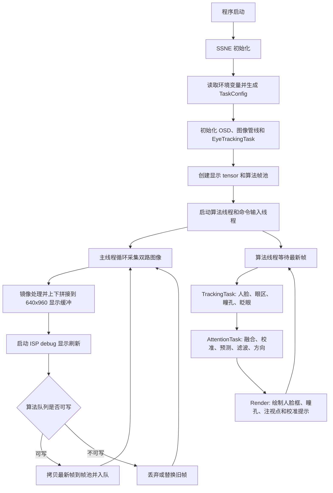

# Eye Tracking Demo

## 项目概述

本项目是基于 SmartSens SSNE 的嵌入式眼动交互演示程序。程序从双路图像管线获取实时灰度图像，完成显示拼接、人脸定位、眼区生成、瞳孔检测、眨眼事件检测、注视点估计、九点校准和 OSD 反馈。

当前版本已经从早期的单文件 demo 拆分为更清晰的三层结构：

- `app/`：应用层，负责 SSNE 生命周期、图像采集、显示、线程、队列、命令输入和性能日志。
- `task/`：业务任务层，负责眼动算法流程编排，包括跟踪任务和注意力任务。
- `src/` 与 `include/`：平台适配层，封装 SSNE、图像管线、SCRFD 人脸检测、OSD 绘制和公共工具。

运行时主线程保持采集和显示链路稳定，算法线程只处理最新帧。当算法处理速度低于采集速度时，旧帧会被丢弃或替换，优先控制端到端延迟。

## 目录结构

```text
eye_track_demo/
├── app/
│   ├── main.cpp                 # 程序入口，根据目标选择默认瞳孔模式
│   ├── eye_tracking_app.hpp     # EyeTrackingApp 对外接口
│   └── eye_tracking_app.cpp     # 应用主流程、线程、队列、命令和性能统计
├── task/
│   ├── types.hpp                # 任务公共数据结构、状态枚举和配置
│   ├── eye_tracking.hpp         # 聚合任务接口
│   ├── eye_tracking.cpp         # 串联 TrackingTask 和 AttentionTask
│   ├── tracking.hpp             # 跟踪任务接口
│   ├── tracking.cpp             # 人脸跟踪、眼区、瞳孔检测和眨眼检测
│   ├── attention.hpp            # 注意力任务接口
│   ├── attention.cpp            # 双眼融合、九点校准、Kalman/One Euro 滤波和方向分类
│   └── kalman.hpp               # 常速度二维 Kalman 滤波器
├── src/
│   ├── pipeline_image.cpp       # 在线图像管线和双路图像获取
│   ├── scrfd_gray.cpp           # SCRFD 灰度人脸检测模型封装
│   ├── utils.cpp                # 检测结果排序、NMS 等工具
│   └── osd-device.cpp           # OSD 设备绘制适配
├── include/
│   ├── common.hpp               # IMAGEPROCESSOR、SCRFDGRAY、检测结果结构
│   ├── utils.hpp                # 工具函数和 VISUALIZER 声明
│   ├── osd-device.hpp           # OSD 设备接口
│   └── ...
├── app_assets/
│   ├── colorLUT.sscl            # OSD 颜色查找表
│   └── models/
│       ├── face_640x480.m1model # SCRFD 人脸检测模型
│       └── pupil_gap.m1model    # 可选瞳孔恢复模型
├── cmake_config/
│   └── Paths.cmake              # SDK、库和工具链路径配置
├── scripts/
│   └── run.sh                   # 运行脚本，优先启动模型目标并兼容经典目标
├── CMakeLists.txt               # 构建配置
└── README.md
```

`task` 目录中的“任务”是业务模块，不代表独立线程。当前所有模型推理仍由单一算法线程顺序执行，避免多个线程同时争用 NPU 上下文。

## 构建目标

项目生成两个可执行程序，二者共享同一套应用层、任务层和平台适配代码，只是默认瞳孔检测模式不同。

- `ssne_ai_demo`：默认使用 `classic` 传统瞳孔检测模式。
- `ssne_ai_demo_model`：默认使用 `hybrid` 混合模式，也是 `scripts/run.sh` 优先启动的目标。

构建配置位于 `CMakeLists.txt`：

- `eye_tracking_core` 静态/目标库包含应用实现、任务实现和平台源文件。
- `ssne_ai_demo` 通过 `EYE_TRACK_DEFAULT_CLASSIC=1` 将默认模式设为 `classic`。
- `ssne_ai_demo_model` 不设置该宏，因此默认模式为 `hybrid`。
- 两个目标都链接 SSNE、CMA buffer、OSD、日志和嵌入式平台相关库。

如果需要修改默认构建目标或默认模式，主要位置如下：

- `CMakeLists.txt`：修改 `ssne_ai_demo` / `ssne_ai_demo_model` 目标，以及 `EYE_TRACK_DEFAULT_CLASSIC` 编译宏。
- `app/main.cpp`：根据 `EYE_TRACK_DEFAULT_CLASSIC` 选择 `classic` 或 `hybrid` 默认模式，并传入 `EyeTrackingApp`。
- `app/eye_tracking_app.cpp`：`LoadTaskConfig()` 读取环境变量并生成 `TaskConfig`。

## 运行方式

在目标设备或部署目录中执行：

```sh
sh ./scripts/run.sh
```

`scripts/run.sh` 优先启动 `./ssne_ai_demo_model`；如果 SDK 部署包只安装了经典目标，则自动回退到 `./ssne_ai_demo`。也可以通过 `EYE_TRACK_APP` 显式指定：

```sh
EYE_TRACK_APP=./ssne_ai_demo_model sh ./scripts/run.sh
```

如果需要启动传统瞳孔模式目标，可以覆盖环境变量：

```sh
EYE_TRACK_APP=./ssne_ai_demo sh ./scripts/run.sh
```

也可以直接覆盖瞳孔检测模式：

```sh
PUPIL_DETECT_MODE=classic sh ./scripts/run.sh
PUPIL_DETECT_MODE=hybrid sh ./scripts/run.sh
PUPIL_DETECT_MODE=model sh ./scripts/run.sh
```

运行入口和模式覆盖相关文件：

- `scripts/run.sh`：选择实际启动的可执行程序，默认优先运行 `./ssne_ai_demo_model`。
- `app/eye_tracking_app.cpp`：读取 `PUPIL_DETECT_MODE`，将 `classic` / `hybrid` / `model` 映射为 `PupilMode`。
- `task/types.hpp`：定义 `PupilMode` 枚举和 `TrackingConfig::pupil_mode` 默认值。

## 总体流程



## 线程模型

### 主线程

主线程由 `EyeTrackingApp::Run()` 驱动，核心职责是图像采集和显示刷新：

1. 调用 `IMAGEPROCESSOR::GetDualImage()` 从双路 sensor 获取图像。
2. 对双路图像分别做镜像处理。
3. 使用 `copy_double_tensor_buffer()` 将两路图像上下拼接到 640x960 输出缓冲。
4. 通过 `start_isp_debug_load()` 推送显示刷新。
5. 将最新算法帧放入帧池队列。
6. 每秒输出一次 `[PERF]` 性能日志。

显示层仍展示双路图像的上下拼接结果。当前算法输入使用第一路图像，第二路图像保留在显示链路中，便于观察、调试或后续扩展。

### 算法线程

算法线程由 `InferenceLoop()` 驱动，只处理队列中的最新帧：

1. 等待主线程提交 `InferenceFrame`。
2. 响应命令标记，例如重新校准、重置、清除眨眼标记。
3. 构造 `FramePacket` 并调用 `EyeTrackingTask::Process()`。
4. 统计 SCRFD 调用次数、瞳孔模型恢复次数、有效 gaze 次数和延迟。
5. 调用 `Render()` 将算法结果转换为 OSD 矩形。
6. 归还帧池 slot。

算法队列深度为 1，帧池大小为 2。主线程入队时如果发现队列中已有旧帧，会优先移除旧帧，只保留最新帧参与算法处理。

### 命令输入线程

命令输入线程读取标准输入，支持运行时控制：

- `q`：退出程序。
- `c`：重新开始九点校准。
- `n`：输出当前状态，包括跟踪模式、人脸状态、注视状态和校准进度。
- `r`：清除眨眼标记。
- `x`：重置跟踪与校准状态。

## 核心模块说明

### 1. 应用层：EyeTrackingApp

`app/eye_tracking_app.cpp` 是当前 demo 的运行骨架，负责把平台输入、算法任务和显示输出连接起来。

主要职责：

- 初始化和释放 SSNE。
- 读取环境变量并生成 `TaskConfig`。
- 初始化 `VISUALIZER`、`IMAGEPROCESSOR` 和 `EyeTrackingTask`。
- 管理显示 tensor、镜像 tensor 和算法帧池。
- 启动主循环、算法线程和命令输入线程。
- 维护最新结果、眨眼标记和 OSD 绘制。
- 输出性能日志。

`Render()` 会把算法结果映射为 OSD 矩形：

- 顶部区域绘制人脸框、左右瞳孔框和校准目标。
- 底部区域绘制归一化注视点和眨眼标记。
- 左上角用九宫格小方块表示当前注视方向。
- 校准过程中用七段数字显示当前校准点和采样数量。

### 2. 聚合任务：EyeTrackingTask

`task/eye_tracking.cpp` 是任务编排层。它不直接实现算法细节，而是固定执行顺序：

```text
FramePacket
  -> TrackingTask::Process()
  -> AttentionTask::Process()
  -> EyeTrackingResult
```

`TrackingTask` 输出 `TrackingState`，包含人脸、眼区、瞳孔、眨眼等低层状态。`AttentionTask` 基于该状态继续生成 `AttentionState`，包含注视点、置信度、方向、校准状态和注意力状态。

### 3. 跟踪任务：TrackingTask

`task/tracking.cpp` 包含眼动跟踪的主要算法逻辑。

#### 人脸检测与跟踪

人脸检测使用 `SCRFDGRAY` 模型，默认模型路径为：

```text
/app_demo/app_assets/models/face_640x480.m1model
```

为了降低 NPU 压力，人脸检测不是每帧都执行，而是通过 `FaceTracker` 控制多速率刷新：

- `REACQUIRE`：重捕状态。没有稳定人脸或连续低置信时，尽快运行 SCRFD。
- `DEGRADED`：降级状态。人脸存在但瞳孔质量不稳定，按较高频率刷新 SCRFD。
- `TRACKING`：稳定跟踪状态。瞳孔连续稳定后，按较低频率刷新 SCRFD，中间帧使用预测框。

默认频率：

- `SCRFD_TRACKING_HZ=30`
- `SCRFD_DEGRADED_HZ=60`

当检测器返回人脸框时，`FaceTracker` 会使用平滑更新框位置和速度；当检测失败或瞳孔质量连续较差时，会退回 `DEGRADED` 或 `REACQUIRE`。

#### 眼区生成

有有效人脸后，跟踪任务根据人脸框和关键点生成左右眼区域：

- 如果 SCRFD 输出关键点，则优先使用前两个关键点作为左右眼中心。
- 如果没有关键点，则按人脸框比例估计左右眼中心。
- `GetEyeBox()` 根据眼中心和人脸宽度裁剪出左右眼 ROI。

#### 瞳孔检测

瞳孔检测由内部 `PupilDetector` 完成，支持三种模式：

- `classic`：只使用传统图像算法。
- `hybrid`：优先使用传统算法，低置信或非稳定状态时使用模型恢复。
- `model`：优先使用模型，必要时回退传统算法。

如果需要修改三种模式的实际行为，主要位置如下：

- `task/types.hpp`：`PupilMode` 定义三种可选模式：`Classic`、`Hybrid`、`Model`。
- `task/tracking.cpp`：`EyeTrackingTask::Initialize()` 根据 `pupil_mode` 设置是否启用模型、是否模型优先。
- `task/tracking.cpp`：`PupilDetector::Detect()` 实现传统检测、模型优先、低置信模型恢复等具体策略。
- `task/tracking.cpp`：`EyeTrackingTask::Process()` 中的 `allow_model` 判断控制混合模式下什么时候允许调用模型恢复。

传统算法主要步骤：

1. 将当前帧拷贝到 Linux buffer。
2. 在眼区 ROI 内统计灰度直方图和平均亮度。
3. 通过低灰度百分位和平均亮度生成瞳孔阈值。
4. 如果上一帧瞳孔稳定，则围绕历史位置缩小搜索区域。
5. 对暗像素做加权质心，得到瞳孔位置。
6. 根据对比度、暗像素比例、紧凑度、时间连续性和边缘距离计算置信度。

可选模型 `pupil_gap.m1model` 用于恢复低置信瞳孔结果。模型输入为 224x224 眼区图像，输出归一化瞳孔坐标。模型输出会再映射回原始图像坐标。

#### 瞳孔 Kalman 滤波与短时预测

瞳孔检测结果发布前会经过左右眼独立的常速度 Kalman Filter。滤波状态为二维位置和二维速度：

```text
state = [x, y, vx, vy]
```

当当前帧有有效瞳孔测量时，流程为：

1. 按时间间隔预测当前瞳孔位置。
2. 根据检测置信度生成测量噪声，置信度越低，测量噪声越大。
3. 使用检测到的瞳孔坐标校正滤波状态。
4. 将位置限制在当前眼区 ROI 内，避免预测点漂出眼区。

当当前帧瞳孔检测失败但滤波器仍有历史状态时，系统会在少量帧内继续发布预测位置，并按帧数衰减置信度。这样可以降低眨眼边缘、运动模糊或模型偶发低置信造成的注视点跳变。超过预测保留帧数后，滤波器会重置，等待新的有效瞳孔测量。

默认参数：

- `PUPIL_KALMAN_ENABLED=1`
- `PUPIL_KALMAN_PROCESS_NOISE=1800`
- `PUPIL_PREDICTION_HOLD_FRAMES=3`

#### 眨眼检测

`BlinkDetector` 使用左右眼暗像素比例估计开闭眼状态：

- 动态维护睁眼基线。
- 连续闭眼若干帧后进入闭眼状态。
- 重新睁眼后根据持续时间判断是否形成有效眨眼事件。
- 有效眨眼持续时间范围为 80 ms 到 800 ms。

发生眨眼事件且当前 gaze 有效时，应用层会在底部 gaze 区域记录一个眨眼标记。

### 4. 注意力任务：AttentionTask

`task/attention.cpp` 负责把瞳孔状态转换为归一化注视状态。

#### 双眼融合

任务先将左右瞳孔位置转换为相对眼中心、相对人脸尺寸的偏移：

```text
left_x  = (left_pupil_x  - left_eye_center_x)  / face_width
left_y  = (left_pupil_y  - left_eye_center_y)  / face_height
right_x = (right_pupil_x - right_eye_center_x) / face_width
right_y = (right_pupil_y - right_eye_center_y) / face_height
```

如果双眼都有效，则按置信度加权融合；如果双眼分歧较大，则选择置信度明显更高的一侧。如果只有单眼有效，则使用单眼结果并降低置信度。

#### 九点校准

校准点为 3x3 九宫格：

```text
(0.1,0.1) (0.5,0.1) (0.9,0.1)
(0.1,0.5) (0.5,0.5) (0.9,0.5)
(0.1,0.9) (0.5,0.9) (0.9,0.9)
```

每个点采集 30 个有效样本。采集完成后，`GazeCalibrator` 对水平和垂直方向分别拟合线性映射参数，把原始瞳孔偏移映射到 0 到 1 的注视坐标。

程序初始化后会自动开始一次校准，也可以运行时输入 `c` 重新校准。

#### Gaze Kalman 预测

九点校准把原始瞳孔偏移映射为 0 到 1 的注视坐标后，`AttentionTask` 会先用常速度 Kalman Filter 对 gaze 做预测和校正。该滤波器同样使用二维位置和速度状态：

```text
state = [gaze_x, gaze_y, gaze_vx, gaze_vy]
```

有有效 gaze 测量时，Kalman Filter 会先根据上一帧速度预测当前注视点，再用当前测量值校正。测量噪声由 `GAZE_KALMAN_MEASUREMENT_NOISE` 和 gaze 置信度共同决定，置信度较低的单眼结果或分歧较大的双眼结果对滤波状态影响更小。

如果当前帧没有可靠 gaze，但滤波器已有稳定历史，系统会在少量帧内继续输出预测 gaze，并按帧数衰减 `confidence`。这让注意力状态在短暂遮挡、眨眼边缘或瞳孔检测空洞时更连续。预测点始终被限制在 `[0, 1]` 范围内。

默认参数：

- `GAZE_KALMAN_ENABLED=1`
- `GAZE_KALMAN_PROCESS_NOISE=8`
- `GAZE_KALMAN_MEASUREMENT_NOISE=0.0004`
- `GAZE_PREDICTION_HOLD_FRAMES=4`

#### One Euro 滤波

Kalman Filter 之后，注视点还会经过 One Euro Filter 做最终平滑。Kalman Filter 主要负责运动模型预测和低置信测量融合，One Euro Filter 主要负责输出去抖和响应速度自适应。

默认参数：

- `ONE_EURO_MIN_CUTOFF=3.0`
- `ONE_EURO_BETA=0.6`
- `ONE_EURO_D_CUTOFF=1.0`

该滤波器在低速时增强稳定性，在快速移动时提高响应速度。

#### 方向分类

最终注视点被分成九个方向：

- `Center`
- `Left` / `Right` / `Up` / `Down`
- `LeftUp` / `RightUp` / `LeftDown` / `RightDown`

分类阈值为归一化坐标的 0.35 和 0.65。方向为 `Center` 且 gaze 有效时，`attentive` 被置为 true。

## 数据结构

主要状态定义在 `task/types.hpp`。

### FramePacket

`FramePacket` 是算法线程输入：

- `image`：当前帧 tensor 指针。
- `frame_id`：帧序号。
- `captured_at`：采集时间戳，用于端到端延迟统计。

### TrackingState

`TrackingState` 是跟踪任务输出：

- `face`：人脸框、置信度、跟踪模式和检测器是否运行。
- `left_eye_box` / `right_eye_box`：左右眼 ROI。
- `left_eye_center` / `right_eye_center`：左右眼中心。
- `left_pupil` / `right_pupil`：滤波后的瞳孔位置、速度、置信度、是否使用模型。
- `blink`：眨眼计数、闭眼状态、事件和持续时间。
- `frame_data_error`：当前算法帧为空、尺寸不足或复制失败。
- `face.detector_error`：SCRFD 本次预处理、推理或取输出失败；与“未检测到人脸”区分。
- `left_pupil.model_error` / `right_pupil.model_error`：瞳孔模型本次失败，结果已回退到传统算法。

### AttentionState

`AttentionState` 是注意力任务输出：

- `gaze`：滤波和预测后的归一化注视坐标。
- `confidence`：注视置信度。
- `direction`：九方向分类结果。
- `calibration`：当前校准状态。
- `gaze_valid`：注视点是否有效。
- `attentive`：是否注视中心区域。

### EyeTrackingResult

`EyeTrackingResult` 聚合完整结果：

```text
EyeTrackingResult
├── TrackingState tracking
└── AttentionState attention
```

## 图像与显示

图像管线位于 `src/pipeline_image.cpp`：

- `IMAGEPROCESSOR::Initialize()` 配置在线输出为 640x480、`SSNE_Y_8` 灰度格式。
- `OpenDualSnrOnline(kPipeline0)` 打开双路 sensor 在线管线。
- `GetDualImage()` 使用 `GetDualImageData()` 获取双路图像。
- `Release()` 关闭在线管线。

显示输出为 640x960：

```text
┌────────────────────────┐
│ 第一层图像 / 跟踪结果   │  y: 0-479
├────────────────────────┤
│ 第二层图像 / gaze 画布  │  y: 480-959
└────────────────────────┘
```

OSD 绘制由 `VISUALIZER` 和 `OsdDevice` 完成。应用层只传入矩形列表，底层负责转换为 OSD 四边形并刷新图层。

## 环境变量配置

运行参数可以通过环境变量覆盖：

```sh
export PUPIL_DETECT_MODE=hybrid       # classic / hybrid / model
export PUPIL_GAP_MODEL=/app_demo/app_assets/models/pupil_gap.m1model
export SCRFD_TRACKING_HZ=30
export SCRFD_DEGRADED_HZ=60
export PUPIL_CONFIDENCE_MIN=0.45
export PUPIL_KALMAN_ENABLED=1
export PUPIL_KALMAN_PROCESS_NOISE=1800
export PUPIL_PREDICTION_HOLD_FRAMES=3
export GAZE_KALMAN_ENABLED=1
export GAZE_KALMAN_PROCESS_NOISE=8
export GAZE_KALMAN_MEASUREMENT_NOISE=0.0004
export GAZE_PREDICTION_HOLD_FRAMES=4
export ONE_EURO_MIN_CUTOFF=3.0
export ONE_EURO_BETA=0.6
export ONE_EURO_D_CUTOFF=1.0
export EYE_TRACK_SAVE_LAST_FRAME=0
sh ./scripts/run.sh
```

参数说明：

- `PUPIL_DETECT_MODE`：瞳孔检测模式。`classic` 只用传统算法，`hybrid` 传统优先并用模型恢复，`model` 模型优先。
- `PUPIL_GAP_MODEL`：可选瞳孔模型路径。
- `SCRFD_TRACKING_HZ`：稳定跟踪状态下 SCRFD 刷新频率。
- `SCRFD_DEGRADED_HZ`：降级状态下 SCRFD 刷新频率。
- `PUPIL_CONFIDENCE_MIN`：瞳孔质量阈值，影响跟踪状态和校准采样。
- `PUPIL_KALMAN_ENABLED`：是否启用瞳孔 Kalman 滤波和短时预测，`1` 启用，`0` 关闭。
- `PUPIL_KALMAN_PROCESS_NOISE`：瞳孔运动模型过程噪声。数值越大，滤波器越容易跟随快速运动；数值越小，输出越平滑。
- `PUPIL_PREDICTION_HOLD_FRAMES`：瞳孔丢测量后继续预测的最大帧数。
- `GAZE_KALMAN_ENABLED`：是否启用 gaze Kalman 预测，`1` 启用，`0` 关闭。
- `GAZE_KALMAN_PROCESS_NOISE`：gaze 运动模型过程噪声。数值越大，响应越快；数值越小，注视点更稳。
- `GAZE_KALMAN_MEASUREMENT_NOISE`：gaze 基础测量噪声。数值越大，越信任预测；数值越小，越信任当前测量。
- `GAZE_PREDICTION_HOLD_FRAMES`：gaze 丢测量后继续输出预测值的最大帧数。
- `ONE_EURO_MIN_CUTOFF`：One Euro 滤波基础截止频率。
- `ONE_EURO_BETA`：速度自适应强度。
- `ONE_EURO_D_CUTOFF`：导数滤波截止频率。
- `EYE_TRACK_SAVE_LAST_FRAME`：设为 `1` 时，退出阶段保存 SCRFD 最后一帧调试数据；默认不写文件，避免存储异常影响正常退出。

模式和模型路径对应的代码修改位置：

- `app/eye_tracking_app.cpp`：`LoadTaskConfig()` 读取 `PUPIL_DETECT_MODE` 和 `PUPIL_GAP_MODEL`。
- `task/types.hpp`：`TrackingConfig::pupil_model` 保存默认瞳孔模型路径。
- `task/tracking.cpp`：`PupilDetector::InitializeModel()` 加载 `pupil_gap.m1model` 并准备模型输入 tensor。
- `task/tracking.cpp`：`PupilDetector::DetectWithModel()` 执行模型推理并把归一化输出映射回图像坐标。

## 模型文件

设备侧模型名称保持不变：

```text
app_assets/models/face_640x480.m1model
app_assets/models/pupil_gap.m1model
```

默认代码中的设备路径为：

```text
/app_demo/app_assets/models/face_640x480.m1model
/app_demo/app_assets/models/pupil_gap.m1model
```

如果部署目录不同，需要通过环境变量或代码配置同步调整路径。

## 性能日志

程序每秒输出一次 `[PERF]`：

```text
[PERF] capture_fps=... enqueue_fps=... drop=... epp_fps=...
       gaze=... scrfd=... model_recovery=... queue=...
       latency_ms_avg=... latency_ms_max=... mode=...
```

同时输出累计健康计数 `[HEALTH]`：

```text
[HEALTH] capture_fail=... restart=成功/尝试 restart_fail=...
         copy_fail=... queue_busy=... stale=... frame_data=...
         scrfd_fail=... pupil_model_fail=... process_fail=...
```

字段含义：

- `capture_fps`：主线程采集帧率。
- `enqueue_fps`：成功提交给算法线程的帧率。
- `drop`：最近一秒丢弃或替换的帧数。
- `epp_fps`：算法线程完成处理的帧率。
- `gaze`：最近一秒有效注视结果数量。
- `scrfd`：最近一秒 SCRFD 实际调用次数。
- `model_recovery`：最近一秒瞳孔模型恢复调用次数。
- `queue`：当前算法队列深度，设计上最大为 1。
- `latency_ms_avg`：最近一秒算法端到端平均延迟。
- `latency_ms_max`：最近一秒算法端到端最大延迟。
- `mode`：当前人脸跟踪状态，可能为 `REACQUIRE`、`DEGRADED` 或 `TRACKING`。

健康字段用于现场验收和故障复盘：`capture_fail` 是取帧失败总数，`restart` 是相机管线重启成功数/尝试数，`copy_fail` 是帧池复制失败数，`queue_busy` 和 `stale` 分别表示队列竞争丢帧和旧帧替换，后三项分别是帧数据、SCRFD、瞳孔模型与算法线程异常计数。

## 异常处理与自动恢复

- 初始化阶段逐项校验 SSNE、模型文件、图像管线和 tensor 容量；任一步失败都会返回失败并按已完成的初始化范围释放资源。
- 双路取帧失败时不再使用无效 tensor。连续失败 3 次后关闭并重开图像管线，重启后清空跟踪历史；失败循环采用 2–200 ms 退避，避免空转占满 CPU。
- SCRFD 的预处理、推理和输出获取任一步失败都会立即短路，不再读取无效输出；失败后按 10–500 ms 指数退避重试，并保留上一跟踪预测，而不是误判为“无人脸”。
- 可选瞳孔模型单次失败会回退到传统检测；连续失败 3 次后禁用模型，传统算法继续提供结果。
- 算法线程捕获标准异常和未知异常，记录 `process_fail` 并确保帧池 slot 被归还，避免单帧故障造成线程退出或帧池耗尽。
- `Release()` 和 `Shutdown()` 按资源就绪标记执行，可安全处理初始化中途失败和重复清理。

板上异常测试至少应覆盖：拔插/遮挡或驱动取帧失败、模型路径错误、SCRFD 推理返回错误、瞳孔模型输出非法、帧复制失败，以及正常运行 60 秒后的有序退出。恢复成功后应确认 `[HEALTH]` 计数符合注入次数、算法线程仍有 `epp_fps` 输出、队列深度不持续为 1。

## 交互命令

运行后终端会提示：

```text
Commands: q=quit c=calibrate n=status r=clear marks x=reset
```

命令说明：

- `q`：请求退出，主线程和算法线程会顺序停止并释放资源。
- `c`：重新开始九点校准。
- `n`：打印当前状态。
- `r`：清除已经记录的眨眼标记。
- `x`：重置人脸跟踪、瞳孔历史、眨眼状态和校准状态。

## 资源释放

退出时 `EyeTrackingApp::Shutdown()` 会按初始化的反序释放资源：

1. 停止算法线程和输入线程。
2. 释放 `EyeTrackingTask`。
3. 释放显示 tensor 和算法帧池 tensor。
4. 关闭 `IMAGEPROCESSOR` 在线管线。
5. 释放 `VISUALIZER` 和 OSD 资源。
6. 调用 `ssne_release()` 释放 SSNE。

这种顺序可以避免算法线程仍在访问 tensor 或模型资源时提前释放底层设备对象。

## 设计特点

1. **结构清晰**：应用框架、业务任务和平台适配分离，后续替换算法或显示实现更直接。
2. **最新帧优先**：算法队列容量为 1，旧帧会被替换，避免延迟持续累积。
3. **多速率检测**：SCRFD 调用频率随跟踪状态变化，稳定时降低检测频率，降级或重捕时提高检测频率。
4. **混合瞳孔检测**：传统算法负责常规帧，模型用于低置信恢复或模型优先模式。
5. **预测和平滑分层**：瞳孔层使用 Kalman Filter 稳定像素坐标，注意力层使用 Kalman Filter 预测 gaze，再用 One Euro Filter 做输出去抖。
6. **校准与滤波内聚**：注视点映射、九点校准、gaze 预测和输出滤波集中在 `AttentionTask`。
7. **异常可恢复且可观测**：运行日志同时输出采集、入队、算法、延迟、模型调用、管线重启和分层错误计数。
