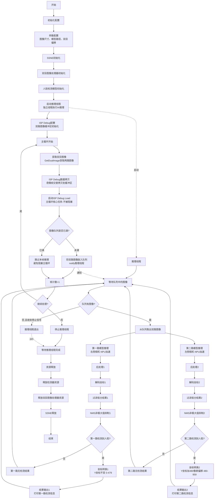

# SSNE AI 演示项目

## 项目概述

本项目是基于 SmartSens SSNE (SmartSens Neural Engine) 的 AI 演示程序，主要展示**双目人脸检测**功能。项目使用 C++ 开发，集成了双目图像处理、AI 模型推理和可视化显示等功能。

### 双目架构说明

本演示使用**双目传感器**配置，两路图像上下拼接显示：
- **第一路图像（右侧）**：显示在上半部分（Y坐标：0-479）
- **第二路图像（左侧）**：显示在下半部分（Y坐标：480-959）
- **显示分辨率**：640×960（每路图像640×480，上下拼接）
- **坐标偏移**：第二路图像的检测结果Y坐标需加上480像素的显示偏移量

### 多线程非阻塞推理架构

为避免AI推理阻塞ISP debug图像拷贝流程，项目采用**多线程非阻塞推理架构**：
- **主线程**：负责图像获取、ISP debug数据拷贝，保证实时性
- **推理线程**：独立线程执行AI推理，不阻塞主循环
- **图像队列**：线程间通过队列传递图像数据，最大队列长度为2帧
- **同步机制**：使用互斥锁和条件变量实现线程安全的数据传递

## 文件结构

```
ssne_ai_demo/
├── demo_face.cpp              # 主演示程序 - 人脸检测演示
├── include/                   # 头文件目录
│   ├── common.hpp            # 公共数据结构定义
│   └── utils.hpp             # 工具函数声明
├── src/                       # 源代码目录
│   ├── utils.cpp             # 工具函数实现
│   ├── pipeline_image.cpp    # 图像处理管道实现
│   └── scrfd_gray.cpp       # SCRFD人脸检测模型实现
├── app_assets/               # 应用资源
│   ├── models/              # AI模型文件
│   │   └── face_640x480.m1model  # 人脸检测模型
│   └── colorLUT.sscl        # 颜色查找表
├── cmake_config/            # CMake配置
│   └── Paths.cmake          # 路径配置文件
├── scripts/                 # 脚本文件
│   └── run.sh              # 运行脚本
├── CMakeLists.txt          # CMake构建配置文件
└── README.md              # 项目说明文档
```

## 核心文件说明

### 1. 主程序文件
- **demo_face.cpp**: 双目人脸检测主演示程序，实现完整的双目检测流程
  - 初始化SSNE引擎
  - 配置双目图像处理器和检测模型
  - 启动独立推理线程（非阻塞AI推理）
  - 主循环处理图像获取和ISP debug拷贝
  - 通过队列向推理线程传递图像数据
  - 双目图像上下拼接与显示
  - 坐标转换（第二路图像需加480像素Y偏移）
  - 优雅退出和资源释放

### 2. 核心类定义
- **common.hpp**: 定义核心数据结构
  - `FaceDetectionResult`: 人脸检测结果结构体
  - `IMAGEPROCESSOR`: 图像处理器类
  - `SCRFDGRAY`: SCRFD人脸检测模型类

- **utils.hpp**: 工具函数声明
  - 检测结果排序和NMS处理函数

### 3. 实现文件
- **src/utils.cpp**: 工具函数实现
  - 归并排序算法
  - 非极大值抑制(NMS)

- **src/pipeline_image.cpp**: 双目图像处理管道
  - 双路图像获取和预处理
  - GetDualImage接口实现
  - 双目图像数据管理

- **src/scrfd_gray.cpp**: SCRFD模型实现
  - 模型初始化和推理
  - 后处理算法
  - 锚点框生成

### 4. 配置文件
- **CMakeLists.txt**: 构建配置文件
  - 定义编译选项和依赖库
  - 指定源文件和头文件路径
  - 链接SSNE相关库

- **cmake_config/Paths.cmake**: 路径配置
  - SDK路径设置
  - 库文件路径配置

### 5. 资源文件
- **app_assets/models/face_640x480.m1model**: 人脸检测AI模型
  - 输入尺寸: 640×480
  - 支持灰度图像
  - 输出人脸边界框和置信度

- **app_assets/colorLUT.sscl**: 颜色查找表
  - 用于显示的颜色配置

### 6. 脚本文件
- **scripts/run.sh**: 运行脚本
  - 环境变量设置
  - 程序启动命令

## Demo 流程图

以下是完整的双目人脸检测流程（多线程非阻塞架构）：



### 流程说明

#### 1. 初始化配置 (`demo_face.cpp:124-168`)

- **参数配置** (`demo_face.cpp:125-136`)
  - 配置单路图像尺寸（640×480）
  - 配置模型输入尺寸（640×480）
  - 配置模型文件路径
  - 配置双目显示偏移量（480像素）

- **SSNE初始化** (`demo_face.cpp:142-145`)
  - 初始化SSNE引擎

- **双目图像处理器初始化** (`demo_face.cpp:147-154`)
  - 初始化双目图像处理器，配置图像尺寸
  - 支持GetDualImage双路图像获取

- **人脸检测模型初始化** (`demo_face.cpp:156-161`)
  - 初始化SCRFD人脸检测模型
  - 加载模型文件
  - 生成anchor boxes

- **启动推理线程** (`demo_face.cpp:166-168`)
  - 创建独立推理线程 `inference_thread`
  - 线程函数：`inference_thread_func`
  - 传递检测器指针和双目显示偏移量参数

- **ISP Debug配置** (`demo_face.cpp:170-184`)
  - 创建双路图像输出缓冲区（640×960）
  - 配置奇偶帧交替机制
  - 初始化ISP调试接口

#### 2. 主处理循环 (`demo_face.cpp:188-227`) - 非阻塞设计

**主循环职责**：只负责图像获取和ISP debug拷贝，不执行AI推理（避免阻塞）

- **获取双目图像** (`demo_face.cpp:192`)
  - 通过 `GetDualImage()` 同时获取两路相机图像（每路640×480）
  
- **ISP Debug数据拷贝** (`demo_face.cpp:194-207`)
  - 根据奇偶帧标志交替拷贝数据
  - 调用 `copy_double_tensor_buffer()` 将双路图像拷贝到输出缓冲区
  - **启动ISP数据加载（主循环核心任务，不能被阻塞）**

- **图像入队操作** (`demo_face.cpp:209-224`) - 非阻塞
  - 获取互斥锁保护队列操作
  - **队列未满**：将双路图像放入队列，通知推理线程处理
  - **队列已满**：跳过本帧推理，避免阻塞主循环
  - 释放锁后主循环继续下一帧

#### 3. 推理线程处理 (`demo_face.cpp:40-119`) - 异步执行

**推理线程职责**：从队列获取图像并执行AI推理，不影响主循环

- **等待图像数据** (`demo_face.cpp:55-72`)
  - 使用条件变量等待队列中的图像
  - 收到通知后获取互斥锁
  - 从队列取出图像数据
  - 释放锁后执行推理

- **双路模型推理** (`demo_face.cpp:78-80`)
  - 第一路：`detector->Predict(&img_pair.img1, det_result1, 0.4f)` 处理右侧相机图像
  - 第二路：`detector->Predict(&img_pair.img2, det_result2, 0.4f)` 处理左侧相机图像
  - 在NPU上执行推理，获取检测结果

- **第一路后处理** (`demo_face.cpp:82-95`)
  - **判断检测结果**: 检查是否检测到人脸
  - **坐标转换**: 
    - 处理右侧相机图像的检测结果
    - Y坐标不变（显示在上半部分：0-479）
    - X坐标保持不变
  - **结果输出**: 打印检测框坐标和帧ID
  - **无检测处理**: 未检测到时输出提示信息

- **第二路后处理** (`demo_face.cpp:97-112`)
  - **判断检测结果**: 检查是否检测到人脸
  - **坐标转换**: 
    - 处理左侧相机图像的检测结果
    - **Y坐标加480像素偏移**（显示在下半部分：480-959）
    - X坐标保持不变
  - **结果输出**: 打印检测框坐标和帧ID
  - **无检测处理**: 未检测到时输出提示信息

#### 4. 优雅退出 (`demo_face.cpp:229-246`)

- **停止推理线程** (`demo_face.cpp:233-240`)
  - 设置停止标志 `stop_inference = true`
  - 通知条件变量唤醒推理线程
  - 推理线程检测到停止信号后退出循环

- **等待线程完成** (`demo_face.cpp:242-246`)
  - 调用 `inference_thread.join()` 等待推理线程安全退出
  - 确保所有推理任务完成

#### 5. 资源释放 (`demo_face.cpp:248-260`)

- **释放检测器资源** (`demo_face.cpp:252`)
  - 释放模型和tensor资源（推理线程内的检测结果已自动释放）

- **释放双目图像处理器资源** (`demo_face.cpp:253`)
  - 关闭双目pipeline通道

- **SSNE释放** (`demo_face.cpp:255-258`)
  - 释放SSNE引擎资源

## 数据流说明

本项目的图像处理流程分为**双目图像采集**、**在线处理（Online Processing）**和**离线处理（Offline Processing）**三个部分，通过不同的pipeline协同工作，实现高效的双目AI推理。

### 1. 双目图像架构

本演示使用双目传感器配置，两路图像独立处理后上下拼接显示：

#### 双目成像结构
```
原始传感器输出（双路独立）:
┌────────────────┐
│  右侧相机       │  第一路 (img_sensor[0])
│  640×480       │  → 检测结果1 (det_result1)
└────────────────┘
┌────────────────┐
│  左侧相机       │  第二路 (img_sensor[1])
│  640×480       │  → 检测结果2 (det_result2)
└────────────────┘

显示输出（上下拼接）:
┌────────────────┐
│  右侧相机       │  Y: 0-479
│  640×480       │  (坐标不变)
├────────────────┤
│  左侧相机       │  Y: 480-959
│  640×480       │  (坐标+480)
└────────────────┘
总分辨率: 640×960
```

#### 双目数据流关键点
1. **独立采集**: 通过`GetDualImage()`同时获取两路图像数据
2. **模型推理**: 两路图像分别进行AI推理，互不干扰
3. **坐标转换**: 
   - 第一路（右侧）：Y坐标不变，显示在0-479区域
   - 第二路（左侧）：Y坐标加480，显示在480-959区域
4. **拼接显示**: 双路结果合并到640×960的显示缓冲区

### 2. 在线处理（Online Processing）- IMAGEPROCESSOR

在线处理主要在 `IMAGEPROCESSOR` 类中完成，负责从传感器获取图像并进行实时预处理：

#### 初始化阶段
```cpp
// 在 IMAGEPROCESSOR::Initialize 中
OnlineSetCrop(kPipeline0, 0, 720, 370, 910);    // 设置裁剪参数
OnlineSetOutputImage(kPipeline0, format_online, 720, 540);         // 设置输出图像尺寸
OpenOnlinePipeline(kPipeline0);                                     // 打开pipe0通道
```
**接口说明：**
- **OnlineSetCrop**: 设置图像裁剪参数，定义裁剪区域边界
  - 函数声明：`int OnlineSetCrop(PipelineIdType pipeline_id, uint16_t x1, uint16_t x2, uint16_t y1, uint16_t y2);`
  - 参数说明：
    - `pipeline_id`: pipeline标识（kPipeline0/kPipeline1）
    - `x1`: 左边界坐标（包含）
    - `x2`: 右边界坐标（不包含）
    - `y1`: 上边界坐标（包含）
    - `y2`: 下边界坐标（不包含）
  - 返回值：0表示设置成功，-1表示设置异常
  - 约束条件：最大宽度8192像素，最大高度8192像素，最小高度1像素
  - 注意：裁剪尺寸需要与输出图像尺寸匹配

- **OnlineSetOutputImage**: 设置输出图像参数，包括尺寸和数据类型
  - 函数声明：`int OnlineSetOutputImage(PipelineIdType pipeline_id, uint8_t dtype, uint16_t width, uint16_t height);`
  - 参数说明：
    - `pipeline_id`: pipeline标识（kPipeline0/kPipeline1）
    - `dtype`: 输出图像数据类型
    - `width`: 输出图像宽度（像素）
    - `height`: 输出图像高度（像素）
  - 返回值：0表示设置成功，-1表示设置异常
  - 约束条件：最大宽度8192像素，最大高度8192像素，最小高度1像素
  - 注意：输出尺寸需要与Crop的尺寸匹配

- **OpenOnlinePipeline**: 打开并初始化指定的pipeline通道
  - 函数声明：`int OpenOnlinePipeline(PipelineIdType pipeline_id);`
  - 参数说明：
    - `pipeline_id`: pipeline标识（kPipeline0/kPipeline1）
  - 返回值：0表示打开成功，-1表示打开异常
  - 功能特点：初始化Image_Capture模块，准备数据传输


#### 图像获取阶段
```cpp
// 在 GetDualImage 函数中
GetImageData(img_sensor[0], kPipeline0, kSensor0, 0);  // 获取第一路图像（右侧相机）
GetImageData(img_sensor[1], kPipeline0, kSensor1, 0);  // 获取第二路图像（左侧相机）
```
**接口说明：**
- **GetDualImage**: 同时获取双目传感器的两路图像数据
  - 内部调用两次`GetImageData`分别获取两个传感器的数据
  - 参数说明：
    - `img_sensor[0]`: 第一路图像tensor（右侧相机）
    - `img_sensor[1]`: 第二路图像tensor（左侧相机）
  - 返回值：通过引用参数返回两路图像数据
  - 功能特点：确保两路图像时间同步

#### 资源释放阶段
```cpp
// 在 IMAGEPROCESSOR::Release 中
CloseOnlinePipeline(kPipeline0);  // 关闭pipe0（裁剪图像通道）
```

**接口说明：**
- **CloseOnlinePipeline**: 关闭指定的pipeline通道并重置默认参数
  - 函数声明：`int CloseOnlinePipeline(PipelineIdType pipeline_id);`
  - 参数说明：
    - `pipeline_id`: pipeline标识（kPipeline0/kPipeline1）
  - 返回值：0表示关闭成功，-1表示关闭异常
  - 功能特点：释放相关资源，重置为默认状态

### 2. 离线处理（Offline Processing）- SCRFDGRAY

离线处理在 `SCRFDGRAY` 类中完成，主要负责AI模型的输入准备和推理。本演示中对双路图像分别进行独立的离线处理。

#### 预处理管道获取
```cpp
// 在 common.hpp 中
AiPreprocessPipe pipe_offline = GetAIPreprocessPipe();                 // 获取离线预处理管道
```
**接口说明：**
- **GetAIPreprocessPipe**: 创建并获取AI预处理管道句柄
  - 函数声明：`AiPreprocessPipe GetAIPreprocessPipe();`
  - 参数说明：无参数
  - 返回值：AiPreprocessPipe结构体变量，用于后续的图像预处理操作
  - 功能特点：初始化AI预处理管道，为离线图像处理做准备

#### 模型输入准备
```cpp
// 在 SCRFDGRAY::Initialize 中
inputs[0] = create_tensor(det_width, det_height, SSNE_Y_8, SSNE_BUF_AI);  // 创建模型输入tensor
```

#### 图像预处理执行
```cpp
// 在 RunAiPreprocessPipe 中
int ret = RunAiPreprocessPipe(pipe_offline, img_sensor[0], inputs[0]);  
```

**接口说明：**
- **RunAiPreprocessPipe**: 执行AI图像预处理操作（双路分别执行）
  - 函数声明：`int RunAiPreprocessPipe(AiPreprocessPipe handle, ssne_tensor_t input_image, ssne_tensor_t output_image);`
  - 参数说明：
    - `handle`: AiPreprocessPipe结构体变量（预处理管道句柄）
    - `input_image`: 输入图像tensor（640×480）
    - `output_image`: 输出图像tensor（模型输入）
  - 返回值：错误状态码，具体含义参考宏定义
  - 功能特点：执行图像resize、格式转换等预处理操作，为AI模型准备输入数据
  - 双目处理：两路图像使用同一个预处理管道，分别执行预处理

#### 预处理管道释放
```cpp
// 在 SCRFDGRAY 析构函数中
ReleaseAIPreprocessPipe(pipe_offline);                                 // 释放预处理管道资源
```

**接口说明：**
- **ReleaseAIPreprocessPipe**: 释放AI预处理管道资源
  - 函数声明：`int ReleaseAIPreprocessPipe(AiPreprocessPipe handle);`
  - 参数说明：
    - `handle`: 目标AiPreprocessPipe结构体变量（预处理管道句柄）
  - 返回值：0表示释放成功
  - 功能特点：释放预处理管道占用的资源，避免内存泄漏


### 3. 双目数据流详细说明

#### 阶段1: 双目图像采集与在线处理
1. **双路原始图像获取**: 从双目传感器同时获取两路图像（每路640×480）
2. **在线处理**: 使用`GetDualImage`接口同时获取两路图像数据
3. **ISP Debug配置**: 
   - 创建640×960的输出缓冲区（用于上下拼接显示）
   - 配置奇偶帧交替机制
   - 通过`copy_double_tensor_buffer`拷贝双路图像到显示缓冲区

#### 阶段2: 双路离线预处理与AI推理
1. **第一路处理**:
   - 使用`RunAiPreprocessPipe`预处理img_sensor[0]（右侧相机）
   - 调用`detector.Predict(&img_sensor[0], det_result1, 0.4f)`执行推理
   - 得到det_result1检测结果

2. **第二路处理**:
   - 使用`RunAiPreprocessPipe`预处理img_sensor[1]（左侧相机）
   - 调用`detector.Predict(&img_sensor[1], det_result2, 0.4f)`执行推理
   - 得到det_result2检测结果

#### 阶段3: 双路后处理与坐标转换
1. **第一路后处理**（右侧相机）:
   - 执行NMS、置信度过滤等后处理
   - 坐标转换：Y坐标保持不变（显示范围：0-479）
   - 输出日志：`[INFO] Right Face detected`

2. **第二路后处理**（左侧相机）:
   - 执行NMS、置信度过滤等后处理
   - **坐标转换：Y坐标加480像素偏移**（显示范围：480-959）
   - 输出日志：`[INFO] Left Face detected`

#### 阶段4: 双目图像拼接与显示
1. **图像拼接**: 两路检测结果合并到640×960的显示缓冲区
2. **上下布局**:
   - 上半部分（Y: 0-479）：右侧相机图像及检测框
   - 下半部分（Y: 480-959）：左侧相机图像及检测框
3. **同步显示**: 双路结果同时更新显示

## 技术特点

1. **多线程非阻塞架构**: 
   - 主线程专注于图像获取和ISP debug拷贝，保证实时性
   - 推理线程异步执行AI推理，不阻塞主循环
   - 使用图像队列和同步机制实现线程间通信
   
2. **双目AI检测**: 使用双目传感器配置，实现双路人脸检测

3. **AI模型**: 使用SCRFD (Sample and Computation Redistribution for Face Detection) 算法

4. **图像处理**: 支持双目图像同步获取、独立处理和拼接显示

5. **坐标转换**: 自动处理双目图像的坐标映射和显示偏移

6. **ISP Debug支持**: 支持奇偶帧交替的图像数据输出，不被AI推理阻塞

7. **性能优化**: 
   - 使用SSNE硬件加速AI推理
   - 队列控制避免内存占用过多（最大2帧缓存）
   - 队列满时跳过推理，优先保证主循环流畅

## 使用说明

项目通过CMake构建，支持交叉编译到目标嵌入式平台。主要功能包括：
- 双目实时人脸检测（多线程非阻塞架构）
- 主线程处理图像获取和ISP debug拷贝（不被AI推理阻塞）
- 推理线程异步执行双路检测
- 双路检测结果独立处理
- 双目图像上下拼接显示（640×960）
- 坐标自动转换（第二路加480像素Y偏移）
- 优雅退出和资源管理

演示程序会持续处理双目图像帧，主线程保证ISP debug的实时性，推理线程在后台异步处理人脸检测，在检测到人脸时分别在上下两个显示区域显示检测结果。
